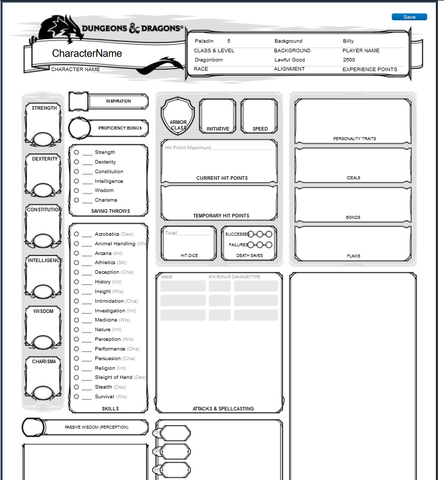

# VueCharacter Sheet
This is a now-abandoned project to create a Dungeons & Dragons 5th Edition character sheet in Vue.js. This was mostly an experiment to learn not only about Vue.js, but also get my hands dirty with some more front-end development

## The Good
Vue.js is a very versitile library. It's great for getting stuff up-and-running quickly. I can easily see how it could be added to previously non-dynamic pages and bring them up to date, so to speak, in a relatively short amount of time.

## The Bad
Using Vue.js for a from-the-ground-up project, I think it's lacking a little bit compared to libraries like Angular. I especially don't like how HTML, CSS, and JS for components are all contained in the same .vue file by convention. I also prefer to use TypeScript, which Vue.js [has support for](https://vuejs.org/v2/guide/typescript.html), but given that it's not the default option, I'm not sure how much trouble it would be worth.

## The Ugly
I really hate messing around with CSS, so I opted to instead convert a PDF character sheet into HTML. The results are... not pretty, and horrible manged HTML and CSS.

## Screenshot
